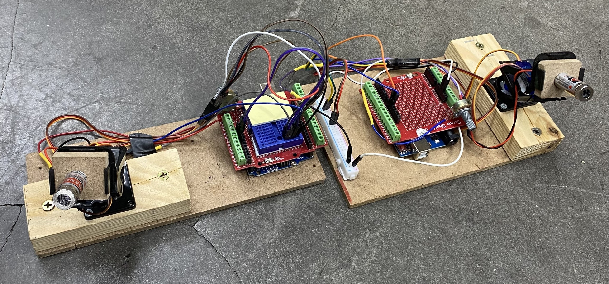
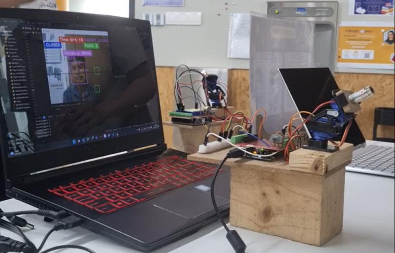

# OpenCV Headshot Tracking with Arduino

An interactive computer vision game that combines real-time face tracking, hand gesture recognition, and Arduino-controlled laser positioning for an immersive gaming experience.

## 🎯 Project Overview

This project implements a finger counting game using advanced computer vision techniques where players must:
- Navigate their face to find hidden safe zones while being tracked by a laser pointer
- Answer mathematical equations by showing the correct number of fingers
- Complete challenges within a 60-second time limit

The system integrates OpenCV face detection, MediaPipe hand tracking, and Arduino servo control to create a unique interactive experience that bridges digital computer vision with physical hardware control.

## 🔧 Hardware Components

### Required Equipment
| Component | Quantity | Purpose |
|-----------|----------|---------|
| **Micro Servo SG90 (180°)** | 4x | X/Y axis laser positioning control |
| **2-DoF Robot Arm Platform Frame** | 2x | Mechanical mounting for servos |
| **Arduino UNO R3** | 2x | Microcontroller for servo control |
| **Proto Screw Shield v1.0** | 2x | Arduino connection interface |
| **10K Potentiometer** | 2x | Laser intensity control for safety |
| **Laser Pointer Module** | 2x | Visual tracking indicator |

### Hardware Setup
The system uses a pan-tilt mechanism controlled by two servo motors:
- **X-axis servo**: Controls horizontal laser movement (0-180°)
- **Y-axis servo**: Controls vertical laser movement (0-180°)
- **Safety feature**: 10K potentiometer reduces laser intensity for eye protection



## 💻 Software Architecture

### Core Technologies
- **Python 3.x** - Main programming language
- **OpenCV** - Computer vision and image processing
- **MediaPipe** - Face mesh detection and hand tracking
- **PyFirmata** - Arduino communication protocol
- **CVZone** - Computer vision utilities
- **NumPy** - Numerical computations

### System Components

#### 1. Face Detection & Tracking
- Real-time face detection using MediaPipe Face Detection
- Face mesh generation with 468 landmark points
- Distance estimation using eye landmarks and triangulation
- Optimal distance: 75cm ± 10cm from camera

#### 2. Hand Gesture Recognition
- MediaPipe Hands for 21-point hand landmark detection
- Finger counting algorithm based on landmark positions
- Support for 0-5 finger recognition
- Real-time gesture processing at 20+ FPS

#### 3. Arduino Servo Control
- PyFirmata-based communication over USB serial
- Real-time coordinate mapping from camera space to servo angles
- Servo position range: 0-180° with safety constraints
- Response time: <100ms for smooth tracking

#### 4. Game Logic
```
Game Flow:
1. Initial Setup → Face positioning & countdown
2. Main Game → Find 5 hidden safe zones (50x50 pixels)
3. Challenges → Answer math equations every 5 seconds
4. Win Condition → Find all zones within 60 seconds
```

## 🎮 Game Features

### Interactive Elements
- **Face Tracking**: Laser follows player's face in real-time
- **Safe Zones**: 5 randomly generated areas where laser deactivates
- **Math Challenges**: Equations appear every 5 seconds requiring finger counting
- **Distance Feedback**: Visual indicators for optimal camera distance
- **Time Pressure**: 60-second countdown timer

### Performance Metrics
- **Frame Rate**: Average 20 FPS during gameplay
- **Detection Accuracy**: >95% for face detection in optimal conditions
- **Response Time**: <100ms from detection to servo movement
- **Finger Recognition**: 90%+ accuracy for clear hand gestures

## 📋 Installation & Setup

### Prerequisites
```bash
# Python dependencies
pip install opencv-python
pip install mediapipe
pip install cvzone
pip install pyfirmata
pip install numpy
```

### Arduino Setup
1. Upload `ServoControl/ServoControl.ino` to Arduino UNO
2. Connect servos to pins 9 (Y-axis) and 10 (X-axis)
3. Connect laser module with potentiometer control
4. Ensure USB serial connection (default: COM7)

### Hardware Assembly
1. Mount servos on 2-DoF robot arm platform
2. Attach laser pointer to servo assembly
3. Connect Arduino with proto shield
4. Wire potentiometer for laser intensity control

## 🚀 Usage

### Running the Game
```bash
python MAIN.py
```

### Game Controls
- **Setup Phase**: Show countdown fingers (3-2-1-0) to start
- **Gameplay**: Move face to find green safe zones
- **Challenges**: Show correct number of fingers for equations
- **Exit**: Press 'Q' to quit

### Optimal Setup
- **Distance**: 65-85cm from camera
- **Lighting**: Well-lit room, avoid strong backlighting
- **Background**: Minimal clutter for better detection
- **Hand Position**: Clear view of dominant hand

## 📊 Results & Performance

### Technical Achievements
- Successfully integrated 3 computer vision algorithms
- Real-time hardware control with <100ms latency
- Stable 20 FPS performance on standard laptops
- 90%+ accuracy in gesture recognition

### Game Statistics
- **Average Game Duration**: 45-60 seconds
- **Player Success Rate**: ~60% (varies by math difficulty)
- **Safe Zone Detection**: Instant response when face enters zone
- **Challenge Frequency**: Every 5 seconds during gameplay

### Demo Performance


The system demonstrates smooth real-time operation with:
- Continuous face tracking and laser positioning
- Accurate finger counting for equation solving
- Responsive safe zone detection
- Stable servo control throughout gameplay

## 🎯 Applications

### Educational Use Cases
- **STEM Education**: Demonstrates computer vision, robotics, and programming integration
- **Interactive Learning**: Engaging way to practice mental math
- **Technology Demonstration**: Showcases real-world CV applications

### Technical Applications
- **Surveillance Systems**: Automated tracking for security applications
- **Robotics**: Object following and interaction systems
- **Industrial Automation**: Vision-guided robotic control
- **Research Platform**: Computer vision algorithm testing

## 🔧 Technical Considerations

### Limitations
- **Multiple Faces**: System optimized for single-user operation
- **Lighting Sensitivity**: Performance degrades in poor lighting
- **Hand Occlusion**: Finger counting requires clear hand visibility
- **Servo Noise**: Mechanical noise during rapid movements

### Safety Features
- **Laser Intensity Control**: Potentiometer reduces power for eye safety
- **Distance Monitoring**: Warns users to maintain safe distance
- **Emergency Stop**: 'Q' key immediately terminates program
- **Servo Limits**: Software constraints prevent mechanical damage

## 👥 Contributors

**Headshot Tracking Team - Fulbright University Vietnam**
- **Pham Dang Yen Nhi** - Computer Vision & Game Logic
- **Nguyen Thanh Long** - Arduino Integration & Hardware
- **Pham Hoang Lan** - System Architecture & Documentation

**Instructor**: Prof. Duong Phung  
**Course**: Computer Vision Spring 2023

## 📚 References

- [OpenCV Documentation](https://docs.opencv.org/)
- [MediaPipe Solutions](https://google.github.io/mediapipe/)
- [PyFirmata Library](https://github.com/tino/pyFirmata)
- [Arduino Servo Library](https://www.arduino.cc/reference/en/libraries/servo/)
- [Computer Vision Zone](https://www.computervision.zone/)

## 📄 License

This project is developed for educational purposes as part of a Computer Vision course at Fulbright University Vietnam. Feel free to use and modify for academic and non-commercial applications.

## 🚀 Future Enhancements

- **Multi-player Support**: Extended tracking for multiple users
- **Advanced Gestures**: Recognition of complex hand movements
- **Difficulty Scaling**: Adaptive challenge levels based on performance
- **Wireless Control**: Bluetooth/WiFi integration for untethered operation
- **Mobile Integration**: Smartphone app for remote control and monitoring